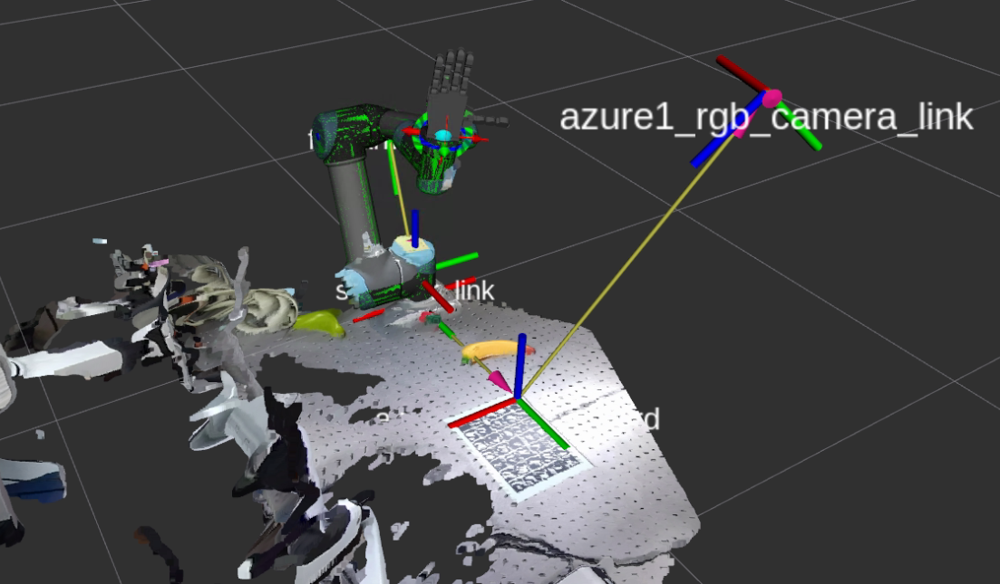

# Azure Kinect Manager

- Azure kinect manager for extrinsic calibration, tf management 
- Clean version of [assembly_camera_manager](https://github.com/gist-ailab/assembly_camera_manager)



### Getting Started

1. Launch camera node and manager
```
$ ROS_NAMESPACE=azure1 roslaunch azure_kinect_ros_driver driver.launch color_resolution:=2160P depth_mode:=NFOV_2X2BINNED fps:=5 tf_prefix:=azure1_
$ roslaunch azure_kinect_manager single_azure_manager.launch 
```
2. Get camera pose from single marker board

```
$ rosservice call /azure1/get_camera_pose_single_markerboard "publish_worldmap: true
n_frame: 10"
```
3. Set camera pose from yaml
```
$ rosservice call /azure1/set_camera_pose "json_file: sample"
```

### TODO


### Authors

* **Seunghyeok Back** [seungback](https://github.com/SeungBack)

### License
This project is licensed under the BSD License


